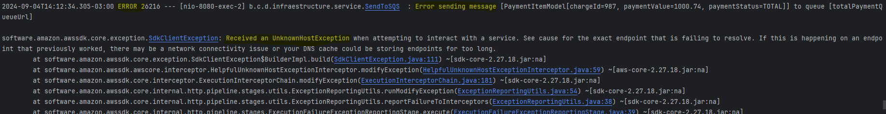

# San Zancanela API

## Objetivo

Atender o que consta no "Desafio" abaixo para desenvolver funcionalidade que recebe código e pagamentos realizados e realiza validações para responder.

## Tecnologias

- Java 17
- Gradle
- Spring Boot 3.3.3
- Spring Web
- JUnit 5
- AWS SQS

## Testes

Para executar os testes, no terminal acesse a pasta `san-zancanela-api` e utilize o comando `../gradlew test jacocoTestCoverageVerification jacocoTestReport`

Depois é só acessar a pasta o arquivo `index.html` que está na pasta `build/reports/jacoco/test/html` para verificar o coverage como da imagem:  

## Executar o projeto

No terminal, acesse a pasta `san-zancanela-api` e execute o comando `../gradlew bootRun`

Isso irá fazer com que o sistema inicie e esteja pronto para receber as chamadas.

Quando a aplicação está iniciada localmente ela disponibiliza o endpoint http://localhost:8080/api/v1/payment

### Postman Collection

Foi configurado um postman collection para realizar as chamadas, o arquivo do collection está disponível na pasta docs: `SanZancanela.postman_collection.json`.  
Importanto a coleção irá ter as chamadas com teste configurado.  
Postman Collection:  
  
Postman request com sucesso:  
  
Postman request com corpo inválido:  
  
Postman request com cliend_id inválido:  
  
Postman request com charge_id inválido:  
  
Postman Run com testes:  
  

### Configuração para SQS

Para que o envio da mensagem seja realizado para a fila do SQS é necessário ter as variáveis de ambiente na execução da aplicação:
- AWS_ACCESS_KEY_ID
- AWS_SECRET_ACCESS_KEY
- AWS_REGION
- AWS_ACCOUNT_ID

#### Erro ao tentar enviar mensagem ao SQS
Caso ocorrer excessão na tentativa de envio de mensagem ao SQS, o sistema irá registrar o erro no log

---

## O Desafio 

### Introdução
O caso de uso consiste em desenvolver uma funcionalidade que recebe um objeto contendo o código do vendedor e uma lista de pagamentos realizados. Cada pagamento é identificado pelo código da cobrança a que ele se refere. O sistema deve validar se o vendedor e o código da cobrança existem na base de dados. Além disso, ele deve verificar se o pagamento é parcial, total ou excedente em comparação com o valor original cobrado. Para cada situação de pagamento, o sistema deve enviar o objeto para uma fila SQS (Simple Queue Service) distinta e retornar o mesmo objeto recebido com a informação do status de pagamento preenchida.

### Requisitos Funcionais
1. Receber objeto contendo código do vendedor e lista de pagamentos
   - ✅ R: Objeto é recebido através do PaymentController e o PaymentRequestDto com validação de campos.

2. Validar existência do vendedor
   O sistema deve verificar se o vendedor informado no objeto existe na base de dados. Caso não exista, o sistema deve retornar uma mensagem de erro informando que o vendedor não foi encontrado.
   - ✅ R: Classes ClientService, ClientRepository e ClientEntity utilizadas para validar.

3. Validar existência do código da cobrança
   Para cada pagamento realizado na lista, o sistema deve verificar se o código da cobrança informado existe na base de dados. Caso não exista, o sistema deve retornar uma mensagem de erro informando que o código da cobrança não foi encontrado.
   - ✅ R: Classes ChargeService, ChargeRepository e ChargeEntity utilizadas para validar.

4. Validar valor do pagamento
   O sistema deve comparar o valor do pagamento recebido na requisição com o valor original cobrado, a fim de determinar se o pagamento é parcial, total ou excedente.
   - ✅ R: Na classe ConfirmPaymentUseCaseImpl tem o método paymentStatus que realiza essa validação.

5. Enviar objeto para fila SQS
   De acordo com a situação de pagamento (parcial, total ou excedente), o sistema deve enviar o objeto para uma fila SQS distinta. Essa fila será responsável por processar o objeto de acordo com a situação de pagamento.
   - ✅ R: Criada a interface PaymentQueueUseCase para ser base para o dominio e feita a implementação através da classe SendToSQS.

6. Preencher status de pagamento
   Após o processamento do objeto, o sistema deve preencher a informação do status de pagamento no mesmo objeto recebido. Essa informação indicará se o pagamento foi parcial, total ou excedente.
   - ✅ R: No final do processamento da chamada é retornado objeto to tipo PaymentResponseDto.

### Requisitos Não Funcionais
Os requisitos não funcionais descrevem características do sistema que não estão diretamente relacionadas às funcionalidades, mas afetam seu desempenho, segurança, usabilidade, entre outros aspectos.

1. Teste unitários
   O caso de uso deve ser testavel através de testes unitários.
    - ✅ R: Criado os testes unitários e adicionado jacoco plugin para geração de relatórios de testes e coverage.

2.  Tratamento de resposta e status code
   O sistema deve retornar uma resposta com status code 200 em caso de sucesso e 4XX em caso de erro
    - ✅ R: Se tudo está ok, retorna 200, para caso tenha erro, foram criadas exceptions e configurado exception handler para tratar e desolver a resposta com objeto do tipo ApiErrorDto.